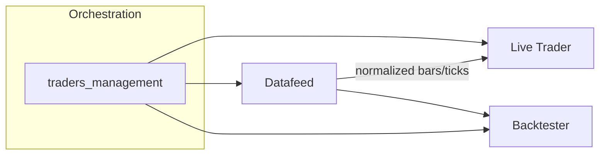

# CoinQuant Senior Dev Assessment

Welcome! This package lets you demonstrate an end‑to‑end workflow:
natural‑language → JSON schema → NautilusTrader back‑test.

## Quick Start

Note: Use latest docker installtion before you progress forward.

```bash
# 1 — build container
make build

# 2 — run schema validator
make validate

# 3 — parse NL → JSON (uses fallback if no OPENAI_API_KEY)
make parse

# 4 — run the back‑test (manual feed implementation)
make backtest
```

Set your **OpenAI key** for full parser power:

```bash
export OPENAI_API_KEY="sk‑..."
```

## What’s Included / Implemented

1. A working bullish divergence strategy on BTC/USDT 1‑minute data, using a
   manual bar‑by‑bar feed and simulated order/portfolio logic inside `run_backtest.py`.
   This keeps the implementation simple and avoids wiring the full NautilusTrader
   BacktestEngine while following the Strategy/lifecycle patterns.
2. Expanded JSON Schema (v2) in `schema_v2.json` including:
   - `description`, `initial_capital`, `sessions`, `days` top‑level fields
   - `series_1_source`, `series_2_source` in conditions (optional)
   - flexible `value` types to support booleans and strings
3. Parser improvements in `parse_strategy.py`:
   - Enhanced system prompt reflecting the expanded schema
   - Fixed usage output, and enriched examples with `description`, `initial_capital`, `sessions`, `days`
   - Offline fallback maintained for the RSI‑of‑MFI and Bullish Divergence examples

## Data

A small sample CSV is included at **data/BTCUSDT_1m_sample.csv**.
Need more? Grab full 1‑minute history free:

* Kaggle – <https://www.kaggle.com/datasets/binance/binance-btcusdt>  
* CryptoDataDownload – direct link:  
  <https://www.cryptodatadownload.com/cdd/Binance_BTCUSDT_1min.csv>

## Helpful Docs

* NautilusTrader GitHub — <https://github.com/nautechsystems/nautilus-trader>
* JSON Schema — <https://json-schema.org/understanding-json-schema/>
* OpenAI Python — <https://github.com/openai/openai-python>

## Submission

Run:

```bash
./check.sh
```

Zip the entire folder **after** it passes. Include:
* your modified source
* `parser_output.json`
* `backtest.log`
* `equity_curve.png`

Good luck! — CoinQuant Team

## Assessment Alignment

| Criteria | Expectation | Status | Notes |
|---|---|---|---|
| Dockerized environment | Dockerfile + docker-compose | ✅ | Python 3.11-slim, Rust toolchain, mounted volume |
| Python deps installed | nautilus-trader, openai, jsonschema, pandas, matplotlib | ✅ | Installed in Docker image |
| Strategy JSON schema v2 | Includes description, initial_capital, sessions, days | ✅ | Expanded fields present in `schema_v2.json` |
| Condition fields | series_1/2, operator, value, action, sources | ✅ | Added `series_1_source`/`series_2_source`; flexible `value` |
| Nested indicators | Supported via params (e.g., RSI-of-MFI) | ✅ | Represented in `series_1_params` |
| Grouped conditions | Support via group_id | ✅ | Field + semantic checks in `validate.py`; see `sample_grouped_strategy.json` |
| Schema validator | PASS/FAIL with details | ✅ | `validate.py` using jsonschema |
| Sample dataset | BTC/USDT 1m CSV | ✅ | `data/BTCUSDT_1m_sample.csv` |
| Natural language parser | Few-shot + OpenAI + fallback | ✅ | Fallback for RSI-of-MFI and Bullish Divergence |
| Parser output handling | JSON-only, formatted, saved | ✅ | Regex extraction, saved as `parser_output.json` |
| Makefile targets | build/validate/parse/backtest/clean | ✅ | All present |
| Grading script | Builds, validates, parses, backtests, verifies | ✅ | Structural JSON compare for parser output; artifacts and trade checks enforced |
| Bullish divergence strategy | Entry/exit logic implemented | ✅ | Manual bar feed with simulated orders |
| Backtest execution | Runs and logs trades | ✅ | Produces `backtest.log` |
| Equity curve | Image output | ✅ | `equity_curve.png` saved |
| NautilusTrader engine integration | Use BacktestEngine/orders | ⚠️ | Not wired; intentional manual feed per scope |

Legend: ✅ Aligned, ⚠️ Partially aligned, ❌ Not aligned

## Current Backtest Structure (Non-Nautilus Engine)

This project intentionally uses a lightweight, manual backtest loop instead of wiring the NautilusTrader BacktestEngine. It demonstrates the strategy logic end‑to‑end while keeping dependencies simple.

- Data feed:
  - Loads `data/BTCUSDT_1m_sample.csv` with pandas and sorts by timestamp.
  - Iterates rows and calls `on_bar_data(open, high, low, close, volume, timestamp)` on the strategy.

- Strategy shell (Nautilus‑style, manual execution):
  - `BullishDivergenceStrategy` mimics NautilusTrader’s `Strategy` lifecycle (`on_start`, `on_stop`) but runs in a manual loop.
  - Uses a simple `RSIIndicator` class (`handle_price`) to compute RSI from closes.

- Entry logic (bullish divergence):
  - Tracks recent lows and their RSI values.
  - Enters long when price makes a lower low while RSI forms a higher low (divergence).

- Exit logic:
  - Exits when RSI exceeds a threshold (default 60) or after a max bar hold (default 10 bars).

- Order simulation (no engine, no venues):
  - `_enter_long` / `_exit_long` append simulated trades to an in‑memory ledger and log actions.
  - No `order_factory`, no fills/fees from an exchange, no engine portfolio accounting.

- Results and artifacts:
  - `calculate_results` summarizes trades and P&L.
  - `generate_equity_curve` reconstructs equity over time from trades and prices and saves `equity_curve.png`.
  - Logs are tee’d to `backtest.log` by `check.sh` for review.

Scope note: This keeps the implementation focused on the strategy logic and artifacts required by the assessment, without wiring NautilusTrader’s BacktestEngine. The manual approach is sufficient for validating entries/exits and producing an equity curve.


## Mock Future Plan (Live Trading Integration) ##

This is a concise roadmap to evolve the project into a live‑capable, dockerized system. It does not change the current implementation; it outlines what to add next.

### Architecture at a glance



### Services
- Datafeed: Ingest and normalize market data (WebSocket/REST), publish a unified stream. Optional caching/buffering; no mandatory persistence to start.
- Live Trader: Subscribe to the stream, run the strategy in real time, place orders. Provide safe enable/disable controls for live trading.
- Backtester: Consume the same stream (or historical snapshots) to run scheduled or on‑demand backtests; trigger via cron or webhook/CLI.

### Containers and runtime
- Three containers in docker‑compose (`datafeed`, `live_trader`, `backtester`) for local dev. Environment variables carry shared config (instrument, timeframe, venue keys).
- Shared base image to ensure identical dependencies; mount strategy code for rapid iteration.

### Single source of truth
- Strategy JSON (schema v2) remains the contract. Both live and backtest flows read the same config for consistent behavior.

### Trading orchestration
- Centralize control in `traders_management`:
  - Initialize trading sessions (allowed days/hours) from strategy JSON or environment.
  - Toggle live trading on/off with pre‑trade validations and risk checks.
  - Manage component lifecycle (start/stop, health/readiness) and route config to services.

### Scheduling
- Backtests run on schedule (cron) or on demand (CLI/API). Store results as artifacts (logs, equity plots) for audit and reproducibility.

### Data and storage
- Start simple: in‑memory streams and no heavy persistence. Add lightweight storage later (snapshots, audit logs) as needs grow.

### Why this shape?
- Separation of concerns, explicit control for live trading, and a single strategy definition shared across services for consistency.
